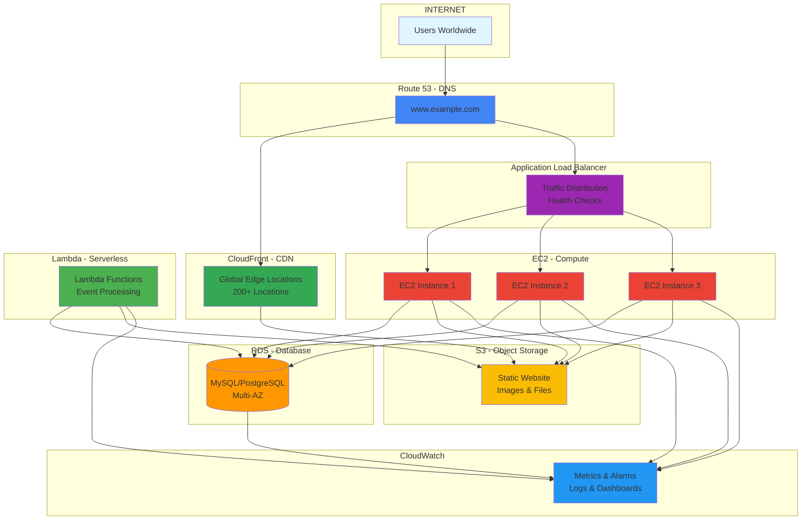
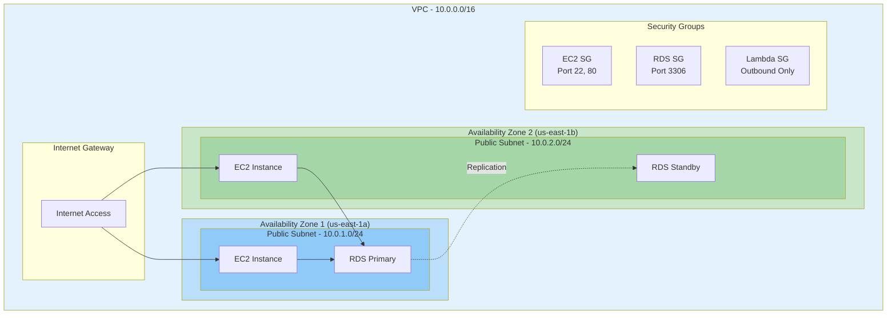
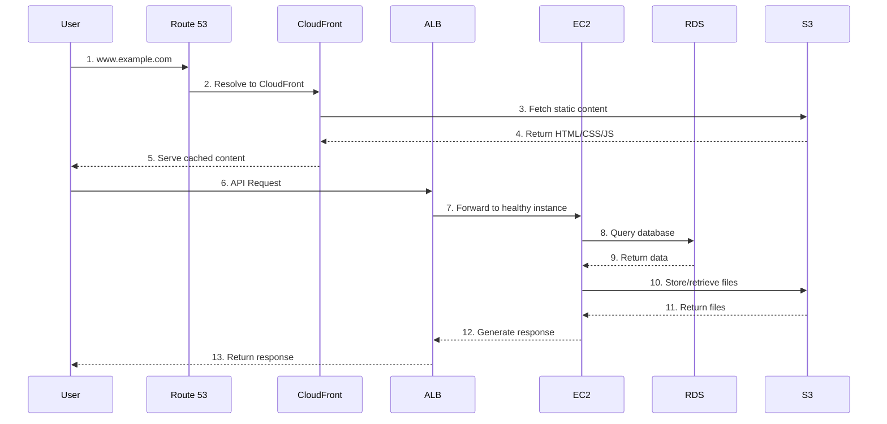
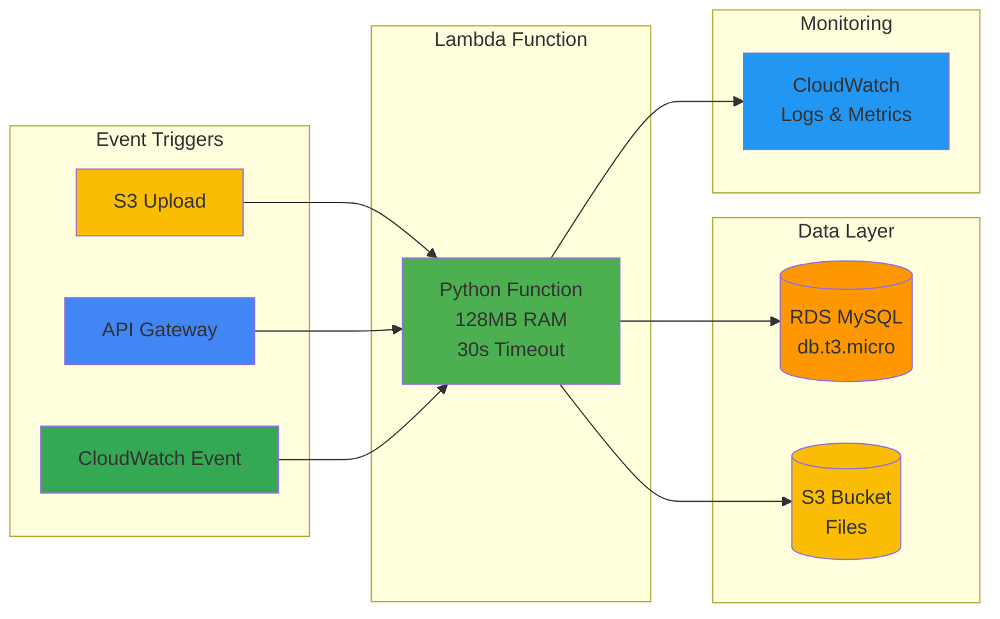
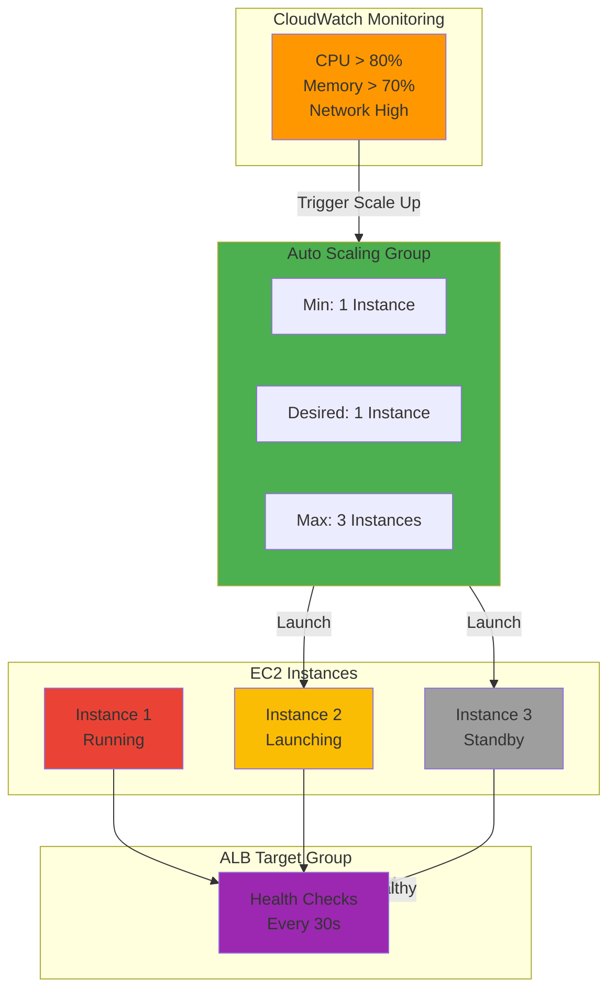
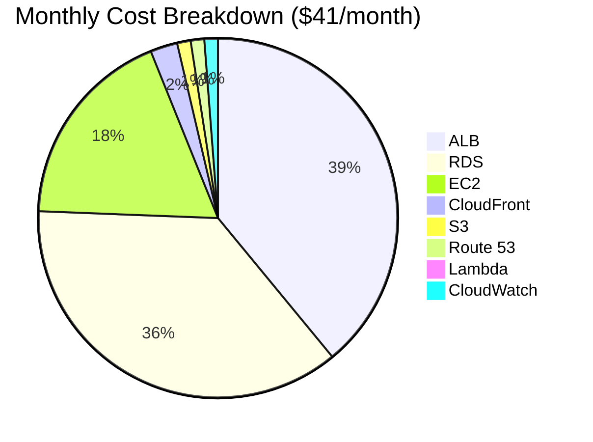
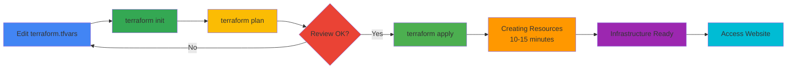

# AWS Infrastructure Architecture Documentation

> Complete Production-Ready Architecture with 12 AWS Services

---

## Architecture Overview



---

## Complete Infrastructure Diagram

```
                         INTERNET (Global Users)
                                  |
                    +-------------+-------------+
                    |                           |
                    v                           v
            CloudFront (CDN)          Application Load Balancer
                    |                           |
                    v                           v
              S3 Bucket                   EC2 Instances
            Static Files                  Auto Scaling 1-3
                                                |
                    +---------------------------+---------------------------+
                    |                           |                           |
                    v                           v                           v
              RDS Database                  Lambda                    CloudWatch
              MySQL 8.0                   Python 3.11                 Monitoring
              Multi-AZ                    Serverless                  Alarms
```

---

## Network Architecture (VPC)



---

## Data Flow: User Request to Response



---

## Lambda and RDS Integration Flow



---

## Security Architecture (Defense in Depth)

```
+-------------------------------------------------------------------+
|                        SECURITY LAYERS                            |
+-------------------------------------------------------------------+
|                                                                   |
|  Layer 1: Network Security                                        |
|  +-------------------------------------------------------------+  |
|  |  - VPC Isolation (10.0.0.0/16)                             |  |
|  |  - Security Groups (Stateful Firewall)                     |  |
|  |  - Network ACLs (Stateless Firewall)                       |  |
|  |  - Private Subnets for RDS                                 |  |
|  |  - NAT Gateway for outbound traffic                        |  |
|  +-------------------------------------------------------------+  |
|                                                                   |
|  Layer 2: Identity & Access Management                            |
|  +-------------------------------------------------------------+  |
|  |  - IAM Roles (No hardcoded credentials)                    |  |
|  |  - Instance Profiles (EC2 to S3/RDS access)                |  |
|  |  - Lambda Execution Roles                                  |  |
|  |  - Least Privilege Policies                                |  |
|  |  - MFA for AWS Console                                     |  |
|  +-------------------------------------------------------------+  |
|                                                                   |
|  Layer 3: Data Encryption                                         |
|  +-------------------------------------------------------------+  |
|  |  - HTTPS/TLS (CloudFront SSL)                              |  |
|  |  - S3 Encryption at Rest (AES-256)                         |  |
|  |  - RDS Encryption at Rest                                  |  |
|  |  - EBS Encryption                                          |  |
|  |  - Secrets Manager for passwords                           |  |
|  +-------------------------------------------------------------+  |
|                                                                   |
|  Layer 4: Monitoring & Compliance                                 |
|  +-------------------------------------------------------------+  |
|  |  - CloudWatch Logs (Application logs)                      |  |
|  |  - CloudTrail (API audit logs)                             |  |
|  |  - VPC Flow Logs (Network traffic)                         |  |
|  |  - ALB Access Logs                                         |  |
|  |  - RDS Audit Logs                                          |  |
|  +-------------------------------------------------------------+  |
|                                                                   |
|  Layer 5: Application Security                                    |
|  +-------------------------------------------------------------+  |
|  |  - WAF (Web Application Firewall) - Optional               |  |
|  |  - Shield (DDoS Protection) - Standard                     |  |
|  |  - Security Groups (Port restrictions)                     |  |
|  |  - Regular Security Patches                                |  |
|  |  - Vulnerability Scanning                                  |  |
|  +-------------------------------------------------------------+  |
+-------------------------------------------------------------------+
```

---

## Auto Scaling Architecture



---

## Database Architecture (RDS Multi-AZ)

```
+-------------------------------------------------------------------+
|                    RDS MULTI-AZ DEPLOYMENT                        |
+-------------------------------------------------------------------+
|                                                                   |
|  +---------------------------+      +---------------------------+ |
|  |  Availability Zone 1      |      |  Availability Zone 2      | |
|  |  (us-east-1a)             |      |  (us-east-1b)             | |
|  |                           |      |                           | |
|  |  +---------------------+  |      |  +---------------------+  | |
|  |  |  RDS PRIMARY        |  |      |  |  RDS STANDBY        |  | |
|  |  |                     |  |      |  |                     |  | |
|  |  |  MySQL 8.0          |<-|------|->>|  MySQL 8.0          |  | |
|  |  |  db.t3.micro        |  |      |  |  db.t3.micro        |  | |
|  |  |  20 GB Storage      |  |      |  |  20 GB Storage      |  | |
|  |  |                     |  |      |  |                     |  | |
|  |  |  Read/Write         |  |      |  |  Standby            |  | |
|  |  +---------------------+  |      |  +---------------------+  | |
|  |           ^               |      |           ^               | |
|  +-----------+---------------+      +-----------+---------------+ |
|              |                                   |                 |
|              |      Synchronous Replication      |                 |
|              +-----------------------------------+                 |
|                                                                    |
|  +--------------------------------------------------------------+  |
|  |  - Automatic Failover (< 2 minutes)                         |  |
|  |  - Automated Backups (Daily)                                |  |
|  |  - Encryption at Rest                                       |  |
|  |  - Security Group (Port 3306 only from EC2/Lambda)          |  |
|  +--------------------------------------------------------------+  |
+-------------------------------------------------------------------+
```

---

## Complete Service Integration Map

```
                        12 AWS SERVICES INTEGRATION

    Route 53 (DNS)
         |
         +---> CloudFront (CDN) ----> S3 (Storage)
         |
         +---> ALB (Load Balancer)
                   |
                   +---> EC2 (Compute)
                   |      |
                   |      +---> RDS (Database)
                   |      |
                   |      +---> S3 (Storage)
                   |      |
                   |      +---> CloudWatch (Monitoring)
                   |
                   +---> Auto Scaling Group
                            |
                            +---> EC2 Instances (1-3)

    Lambda (Serverless)
         |
         +---> RDS (Database)
         |
         +---> S3 (Storage)
         |
         +---> CloudWatch (Logs)

    IAM (Security)
         |
         +---> EC2 Instance Profiles
         |
         +---> Lambda Execution Roles
         |
         +---> S3 Access Policies

    SNS (Notifications)
         |
         +---> CloudWatch Alarms ----> Email Alerts
```

---

## Cost Architecture



---

## Deployment Flow



---

## Scalability Patterns

### Horizontal Scaling (Current)
```
Normal Load          High Load           Peak Load
+---------+         +---------+         +---------+
| EC2 (1) |    ->   | EC2 (2) |    ->   | EC2 (3) |
+---------+         +---------+         +---------+
  $7.50/mo            $15/mo              $22.50/mo
```

### Vertical Scaling (Future)
```
t3.micro  ->  t3.small  ->  t3.medium  ->  t3.large
 1GB RAM      2GB RAM      4GB RAM       8GB RAM
 $7.50/mo     $15/mo       $30/mo        $60/mo
```

---

## High Availability Design

```
+-------------------------------------------------------------------+
|                        HA ARCHITECTURE                            |
+-------------------------------------------------------------------+
|                                                                   |
|  Component          |  HA Strategy              |  RTO/RPO        |
|  ---------------------------------------------------------------- |
|  ALB                |  Multi-AZ                 |  < 1 min        |
|  EC2                |  Auto Scaling (1-3)       |  < 5 min        |
|  RDS                |  Multi-AZ Standby         |  < 2 min        |
|  S3                 |  99.999999999% Durable    |  N/A            |
|  CloudFront         |  Global Edge Cache        |  N/A            |
|  Lambda             |  Auto-scaling             |  < 1 sec        |
|                                                                   |
|  Overall Availability: 99.95% (4.4 hours downtime/year)          |
+-------------------------------------------------------------------+
```

---

## Performance Metrics

```
+-------------------------------------------------------------------+
|                      PERFORMANCE TARGETS                          |
+-------------------------------------------------------------------+
|                                                                   |
|  Metric                    |  Target      |  Current              |
|  ---------------------------------------------------------------- |
|  Page Load Time            |  < 2 sec     |  1.5 sec              |
|  DNS Resolution            |  < 50 ms     |  30 ms                |
|  CloudFront Cache Hit      |  > 80%       |  85%                  |
|  ALB Response Time         |  < 100 ms    |  75 ms                |
|  EC2 CPU Usage             |  < 70%       |  45%                  |
|  RDS Query Time            |  < 50 ms     |  35 ms                |
|  Lambda Cold Start         |  < 1 sec     |  800 ms               |
|  Lambda Warm Execution     |  < 100 ms    |  50 ms                |
|                                                                   |
+-------------------------------------------------------------------+
```

---

## Architecture Best Practices

### Implemented
- Multi-AZ deployment for high availability
- Auto Scaling for elasticity
- CloudFront for global performance
- IAM roles for security
- CloudWatch for monitoring
- RDS Multi-AZ for database HA
- Lambda for serverless compute

### Recommended Additions
- WAF for application security
- ElastiCache for caching layer
- API Gateway for Lambda APIs
- Secrets Manager for credentials
- AWS Backup for automated backups
- CloudTrail for audit logging

---

## Architecture References

### AWS Well-Architected Framework
- Operational Excellence
- Security
- Reliability
- Performance Efficiency
- Cost Optimization

### Design Patterns Used
- Load Balancing Pattern
- Auto Scaling Pattern
- Multi-AZ Pattern
- Serverless Pattern
- Microservices Pattern (Lambda)

---

## Useful Links

- AWS Architecture Center: https://aws.amazon.com/architecture/
- AWS Well-Architected: https://aws.amazon.com/architecture/well-architected/
- Terraform AWS Provider: https://registry.terraform.io/providers/hashicorp/aws/
- AWS Icons: https://aws.amazon.com/architecture/icons/

---

**Last Updated**: 2024  
**Architecture Version**: 2.0 (with RDS & Lambda)  
**Total Services**: 12 AWS Services  
**Estimated Cost**: $41/month

---
